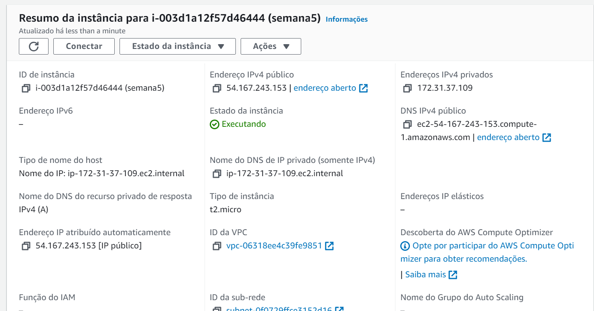
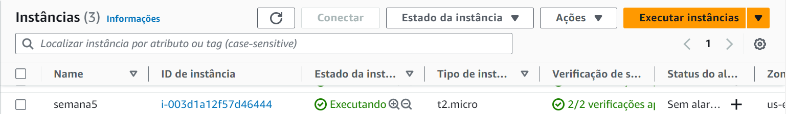
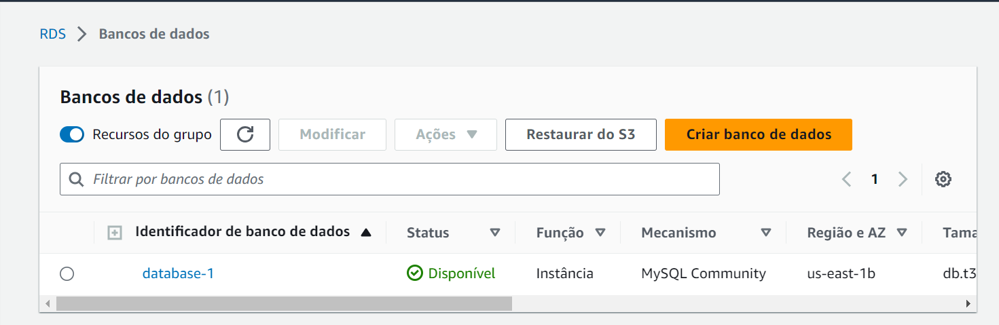
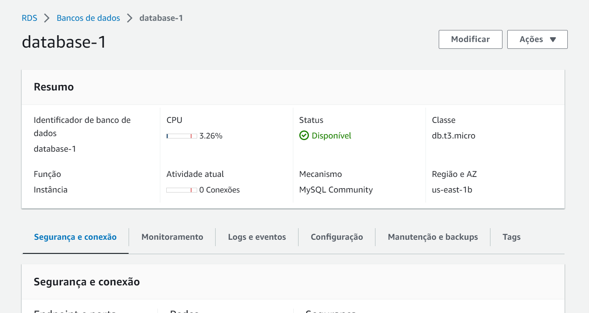
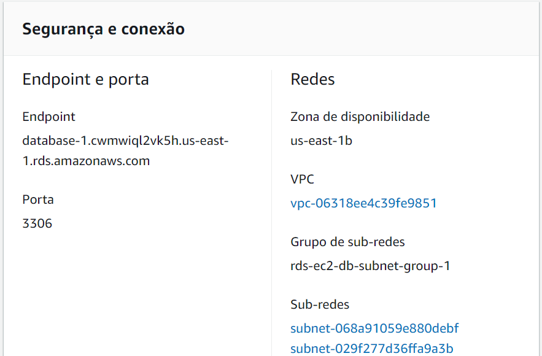
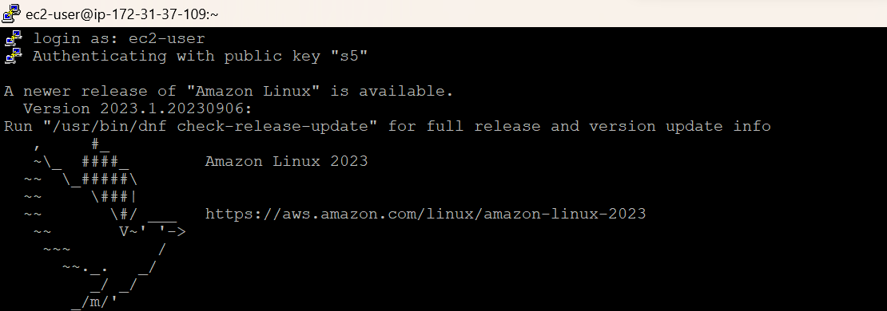
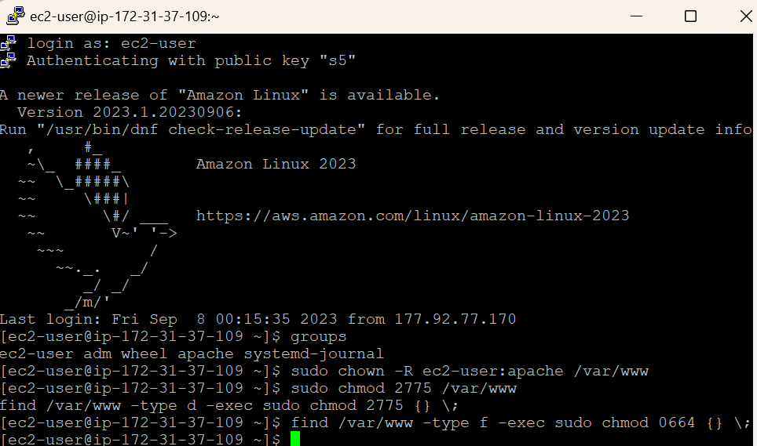
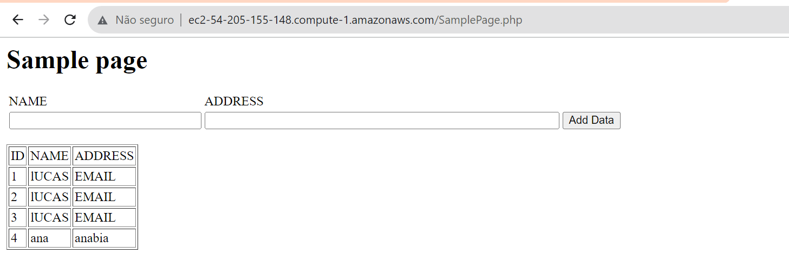

# Elaboração de aplicação integrada a um banco de dados

## Objetivo
Instalar um servidor web Apache com PHP e criar um banco de dados MySQL. Tanto a instância do Amazon EC2 quanto a instância de banco de dados são executadas em uma nuvem privada virtual (VPC) baseada no serviço Amazon VPC.

## 1- Tutorial

Cria-se uma instancia em EC2 chamada "semana5":

Aqui podemos ver o tipo da instancia segundo o tutorial (t2.micro):

Os dados da instancia "semana5":


Com a instancia criada, cria-se uma instancia de banco de dados RDS, seguindo o tutorial.




A partir disso, instala-se um servidor web na instancia EC2, seguindo o tutorial.
Conectamos o EC2




Apos isso, fazemos a alteração do código php disponibilizado e adcionamos mais 2 campos desejaveis. Atendendo com 3 tipos diferentes de váriavies:
```NOME (uma string com 45 caracteries de limite), IDADE (uma string, já que não seria feito cálculo), PESO (sendo um inteiro) e ALTURA (sendo um float por ser em Metros)```

Link do drive que contem o video:
*https://drive.google.com/drive/folders/1Wr_QoSDRtzPWidcRKx5YJF2zg8VfSqAK?usp=drive_link*


